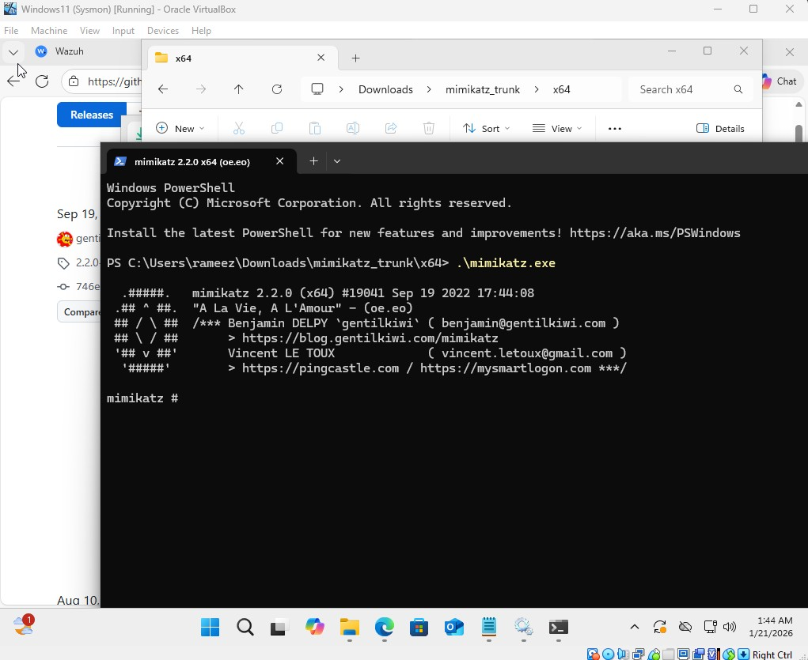
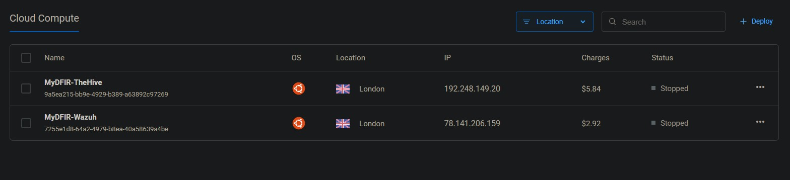

# SOC Automation Lab – Architecture Overview

## 📌 Overview

This document outlines the infrastructure and workflow of the SOC Automation Lab.  
The lab simulates a real-world SOC environment integrating:

- SIEM (Wazuh)
- SOAR (Shuffle)
- Case Management (TheHive)
- Email alerting
- Automated active response

---

## 🏗️ High-Level Architecture

## 🔁 End-to-End Workflow

1. Windows 10 client generates security events.
2. Wazuh Agent forwards logs to Wazuh Manager.
3. Wazuh analyzes events and triggers alerts.
4. Alerts are sent to Shuffle (SOAR).
5. Shuffle enriches IOCs using OSINT (VirusTotal).
6. Shuffle creates a case in TheHive.
7. Email notification is sent to the SOC Analyst.
8. Upon approval, a response action is triggered.
9. Wazuh performs active response on the Windows endpoint.

This demonstrates a full detection-to-response pipeline.

---

## 🎯 Threat Simulation – Mimikatz Execution

To validate the pipeline, **Mimikatz v2.2.0 (x64)** was executed directly on the Windows 11 virtual machine running inside Oracle VirtualBox. Mimikatz is a well-known credential dumping tool mapped to **MITRE ATT&CK T1003 – OS Credential Dumping**.

The Wazuh Agent (with Sysmon installed) captured the process creation event via the Windows Event Channel and forwarded it to the Wazuh Manager, triggering the full automated response chain.

---

## ☁️ Cloud Infrastructure

The lab is deployed across two dedicated Ubuntu cloud servers to simulate production-like separation of services.

| Server | IP Address | Location | Status |
|--------|-----------|----------|--------|
| MyDFIR-TheHive | 192.248.149.20 | London | Stopped |
| MyDFIR-Wazuh | 78.141.206.159 | London | Stopped |

---

## 🛡️ Wazuh Server (SIEM)

### Specifications
- **OS:** Ubuntu 24.04 LTS (x64)
- **vCPUs:** 4
- **RAM:** 8GB (8192 MB)
- **Storage:** 160GB SSD
- **IP Address:** 78.141.206.159
- **Location:** London

### Responsibilities
- Receive endpoint logs from the Wazuh Agent
- Apply built-in and custom detection rules
- Trigger alerts and forward them to Shuffle via webhook
- Execute active response commands (firewall-drop) on the endpoint

---

## 🧠 TheHive Server (Case Management)

### Specifications
- **OS:** Ubuntu 24.04 LTS (x64)
- **vCPUs:** 6
- **RAM:** 16GB (16384 MB)
- **Storage:** 320GB SSD
- **IP Address:** 192.248.149.20
- **Location:** London

### Responsibilities
- Receive enriched alerts from Shuffle
- Automatically create cases
- Store observables, TTPs, and artifacts
- Provide investigation dashboard for the SOC Analyst

---

## 🔄 Data Flow Breakdown

### 1️⃣ Endpoint Telemetry
The Windows 11 machine runs the Wazuh Agent alongside Sysmon for enhanced process telemetry. Security logs are forwarded to the Wazuh Manager over TCP port 1514.

### 2️⃣ Detection Engine
Wazuh applies built-in and custom rules to identify suspicious activity. The Mimikatz detection uses a custom Sysmon-based rule (ID 100002, Level 15) that matches the original filename field to catch renamed binaries.

### 3️⃣ SOAR Automation
Shuffle receives the alert via webhook and orchestrates the response:
- Extracts the SHA256 hash from the alert payload
- Queries VirusTotal for hash reputation (OSINT enrichment)
- Decides next action based on enrichment results

### 4️⃣ Case Creation
TheHive automatically receives the enriched alert from Shuffle and creates an incident case pre-populated with the alert title, MITRE TTP (T1003), TLP:AMBER, severity, and host information — ready for analyst triage.

### 5️⃣ Email Notification
The SOC analyst receives an automated email via Shuffle containing the alert time, title, affected host, and severity level — eliminating the need to log into any platform for initial awareness.

### 6️⃣ Automated Response
Once malicious activity is confirmed, Shuffle triggers a response action back to Wazuh, which executes the `firewall-drop` active response to block the attacker's IP directly on the compromised endpoint.

---

## 🎯 Architecture Goals

- Simulate real SOC infrastructure on cloud servers
- Demonstrate SIEM-to-SOAR integration via webhook
- Automate IOC enrichment and case creation
- Reduce manual analyst workload through orchestration
- Enable active endpoint containment without human intervention

---

## ✅ Summary

This architecture reflects modern SOC design principles by combining:

- **Log collection** – Wazuh Agent + Sysmon on Windows endpoint
- **Detection** – Custom Wazuh rules with MITRE ATT&CK mapping
- **Enrichment** – Automated VirusTotal hash reputation lookup via Shuffle
- **Case management** – Auto-created TheHive alerts with full context
- **Notification** – Real-time email to SOC analyst
- **Automated containment** – Wazuh active response firewall block

The lab demonstrates a complete and automated incident response lifecycle from initial threat execution through to endpoint containment.