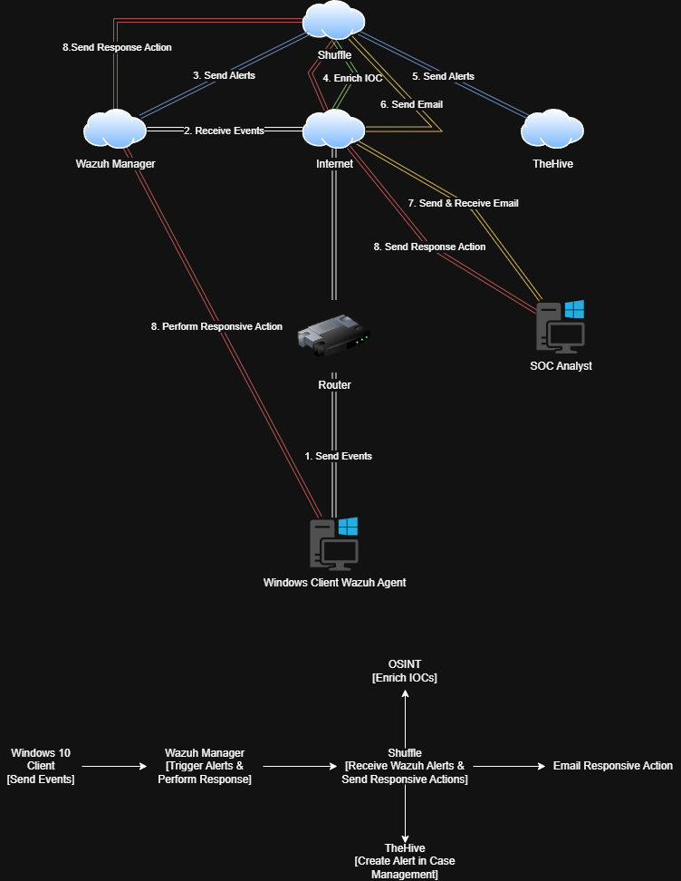
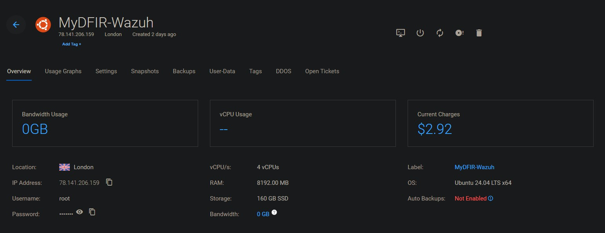
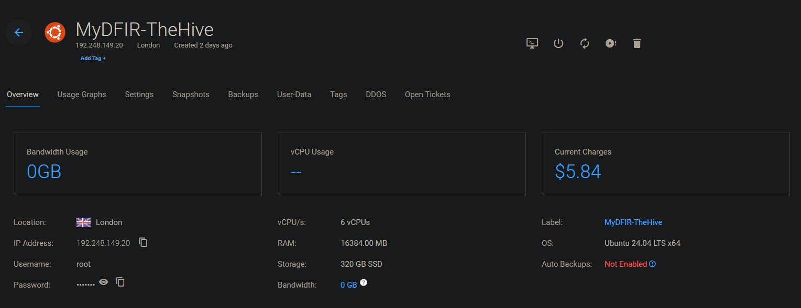

# SOC Automation Lab – Architecture Overview

## 📌 Overview

This document outlines the infrastructure and workflow of the SOC Automation Lab.  
The lab simulates a real-world SOC environment integrating:

- SIEM (Wazuh)
- SOAR (Shuffle)
- Case Management (TheHive)
- Email alerting
- Automated active response

---

# 🏗️ High-Level Architecture

## 🔁 End-to-End Workflow

1. Windows 10 client generates security events.
2. Wazuh Agent forwards logs to Wazuh Manager.
3. Wazuh analyzes events and triggers alerts.
4. Alerts are sent to Shuffle (SOAR).
5. Shuffle enriches IOCs using OSINT.
6. Shuffle creates a case in TheHive.
7. Email notification is sent to the SOC Analyst.
8. Upon approval, a response action is triggered.
9. Wazuh performs active response on the Windows endpoint.

This demonstrates a full detection-to-response pipeline.

---

# ☁️ Cloud Infrastructure

The lab is deployed across two dedicated Ubuntu cloud servers to simulate production-like separation of services.

---

## 🛡️ Wazuh Server (SIEM)

### Specifications
- OS: Ubuntu 24.04 LTS (x64)
- vCPUs: 4
- RAM: 8GB
- Storage: 160GB SSD
- Location: London

### Responsibilities
- Receive endpoint logs
- Apply detection rules
- Trigger alerts
- Send alerts to Shuffle
- Execute active response commands

---

## 🧠 TheHive Server (Case Management)

### Specifications
- OS: Ubuntu 24.04 LTS (x64)
- vCPUs: 6
- RAM: 16GB
- Storage: 320GB SSD
- Location: London

### Responsibilities
- Receive enriched alerts from Shuffle
- Automatically create cases
- Store observables and artifacts
- Provide investigation dashboard for SOC Analyst

---

# 🔄 Data Flow Breakdown

### 1️⃣ Endpoint Telemetry
Windows 10 machine runs the Wazuh Agent and forwards security logs to the Wazuh Manager.

### 2️⃣ Detection Engine
Wazuh applies built-in and custom rules to identify suspicious activity.

### 3️⃣ SOAR Automation
Shuffle:
- Receives alerts via webhook
- Extracts IOCs (IP, domain, hash, etc.)
- Performs OSINT enrichment
- Decides next action

### 4️⃣ Case Creation
TheHive:
- Automatically creates an incident case
- Attaches enriched observables
- Makes alert available for analyst review

### 5️⃣ Automated Response
If malicious activity is confirmed:
- Shuffle triggers response
- Wazuh executes active response
- Endpoint is contained

---

# 🎯 Architecture Goals

- Simulate real SOC infrastructure
- Demonstrate SIEM-to-SOAR integration
- Automate enrichment & case creation
- Reduce manual analyst workload
- Enable active endpoint response

---

# ✅ Summary

This architecture reflects modern SOC design principles by combining:

- Log collection
- Detection
- Enrichment
- Case management
- Notification
- Automated containment

The lab demonstrates a complete and automated incident response lifecycle.