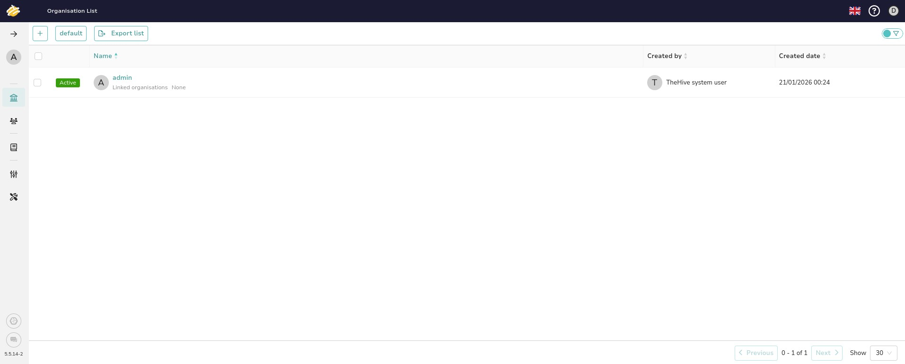
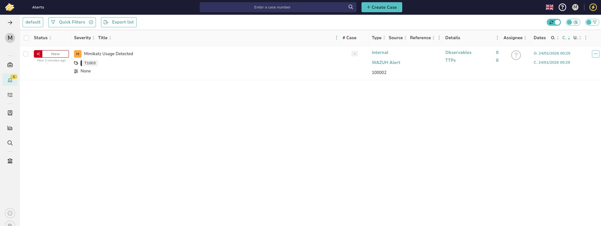
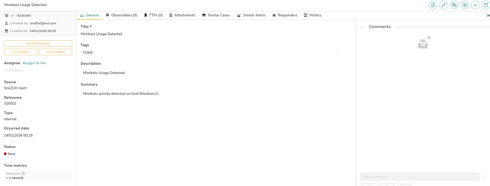

# SOC Automation Lab – Complete Project Report

**Author:** Rameez  
**Date:** January 2026  
**Version:** 1.0  
**Status:** Complete

---

## 📋 Table of Contents

1. [Project Overview](#1-project-overview)
2. [Architecture & Infrastructure](#2-architecture--infrastructure)
3. [Folder Structure](#3-folder-structure)
4. [Component Walkthrough](#4-component-walkthrough)
   - [Wazuh – SIEM](#41-wazuh--siem)
   - [Shuffle – SOAR](#42-shuffle--soar)
   - [TheHive – Case Management](#43-thehive--case-management)
5. [End-to-End Incident Response Walkthrough](#5-end-to-end-incident-response-walkthrough)
6. [Detection Validation – Mimikatz](#6-detection-validation--mimikatz)
7. [Key Configurations Summary](#7-key-configurations-summary)
8. [What Worked Well](#8-what-worked-well)
9. [Challenges & How They Were Solved](#9-challenges--how-they-were-solved)
10. [Improvements & Recommendations](#10-improvements--recommendations)
11. [Next Steps](#11-next-steps)
12. [Skills Demonstrated](#12-skills-demonstrated)

---

## 1. Project Overview

The SOC Automation Lab is a fully functional, cloud-hosted Security Operations Centre (SOC) simulation that demonstrates a complete automated incident response pipeline. The lab was designed to replicate how modern enterprise SOC teams handle security events — from initial detection on an endpoint through to automated investigation, case creation, analyst notification, and active endpoint containment.

The project integrates four core technologies:

| Component | Technology | Role |
|-----------|-----------|------|
| Endpoint | Windows 11 + Sysmon (VirtualBox) | Generates security telemetry |
| SIEM | Wazuh | Log collection, detection, active response |
| SOAR | Shuffle | Orchestration, enrichment, automation |
| Case Management | TheHive | Incident case creation and analyst triage |

The entire pipeline — from a threat being executed on the endpoint to a case appearing in TheHive and an email landing in the analyst's inbox — completes in **under one second**, with zero manual intervention.

---

## 2. Architecture & Infrastructure


### Cloud Servers

The lab runs across two dedicated Ubuntu cloud servers hosted in London, keeping SIEM and case management separated as they would be in a real production environment.


| Server | Label | IP Address | vCPUs | RAM | Storage | OS |
|--------|-------|-----------|-------|-----|---------|-----|
| SIEM | MyDFIR-Wazuh | 78.141.206.159 | 4 | 8GB | 160GB SSD | Ubuntu 24.04 LTS |
| Case Mgmt | MyDFIR-TheHive | 192.248.149.20 | 6 | 16GB | 320GB SSD | Ubuntu 24.04 LTS |

**Wazuh Server:**


**TheHive Server:**


### High-Level Data Flow

```
Windows 11 Endpoint (VirtualBox)
        │
        │  Sysmon Events (TCP 1514)
        ▼
  Wazuh Manager (SIEM)
        │
        │  Rule 100002 fires → Webhook (JSON)
        ▼
    Shuffle (SOAR)
        ├──► VirusTotal (SHA256 Hash Lookup)
        ├──► TheHive (Create Alert)
        └──► Email Notification → SOC Analyst
        │
        │  Response Action
        ▼
  Wazuh Active Response
        │
        │  firewall-drop
        ▼
  Windows 11 Endpoint (Contained)
```

---

## 3. Folder Structure

```
SOC-Automation-Lab/
│
├── README.md                    ← This file (Master Report)
│
├── Architecture/
│   ├── README.md                ← Architecture overview & infrastructure details
│   ├── soc-architecture.png     ← High-level architecture diagram
│   ├── SOC_Lab_Diagram_drawio.png ← Detailed data flow diagram
│   ├── Cloud-Servers.jpg        ← Cloud compute overview
│   ├── Wazuh-Cloud-Server.jpg   ← Wazuh server specs
│   ├── TheHive-Cloud-Server.jpg ← TheHive server specs
│   └── Threat.jpg               ← Mimikatz execution on Windows 11
│
├── Wazuh/
│   ├── README.md                ← Wazuh config & detection walkthrough
│   ├── wazuh.conf               ← Full Wazuh Manager configuration
│   ├── Mimikatz-Rule.jpg        ← Custom detection rule (ID 100002)
│   ├── Mimikatz-Detection.jpg   ← Alert in OpenSearch/Kibana
│   ├── active-response-config.jpg ← firewall-drop active response block
│   ├── Shuffler-Link-ossec.jpg  ← Shuffle webhook integration in ossec.conf
│   └── Wazuh-Application.jpg    ← Wazuh dashboard overview
│
├── Shuffle/
│   ├── README.md                ← Shuffle workflow walkthrough
│   ├── Shuffler-linking.jpg     ← Webhook trigger & incoming payload
│   ├── VirusTotal-Config.jpg    ← VirusTotal hash enrichment node
│   ├── Hive-Config.jpg          ← TheHive alert creation node & workflow
│   └── Email-Response-Config.jpg ← Email notification node
│
└── TheHive/
    ├── README.md                ← TheHive config & case creation walkthrough
    ├── thehive.conf             ← Full TheHive application configuration
    ├── TheHive-Application.jpg  ← Organisation list overview
    ├── Hive-Response.jpg        ← Auto-created Mimikatz alert in alerts list
    └── Hive-Response-Details.jpg ← Full alert detail view
```

---

## 4. Component Walkthrough

### 4.1 Wazuh – SIEM

Wazuh serves as the detection engine of the lab. The Wazuh Agent is installed on the Windows 11 virtual machine alongside **Sysmon**, which provides rich process-level telemetry including the `originalFileName` field — a key detail that allows detection even when an attacker renames their malicious binary.


**Key configuration highlights from `wazuh.conf`:**

- Agent communication over TCP port 1514 (secure, encrypted)
- Rootcheck runs every 12 hours checking files, trojans, PIDs, and ports
- Syscollector collects hardware, OS, network, packages, processes, and users every hour
- File Integrity Monitoring (syscheck) watches `/etc`, `/bin`, `/usr/bin`, `/sbin`, and `/boot`
- Vulnerability detection feed updates every 60 minutes
- Malicious IOC lists maintained for hashes, IPs, and domains

**Custom Mimikatz Detection Rule:**


```xml
<rule id="100002" level="15">
  <if_group>sysmon_event1</if_group>
  <field name="win.eventdata.originalFileName" type="pcre2">(?i)mimikatz\.exe</field>
  <description>Mimikatz Usage Detected</description>
  <mitre>
    <id>T1003</id>
  </mitre>
</rule>
```

The rule triggers at **severity level 15 (Critical)** on Sysmon Event ID 1 (Process Creation), using the `originalFileName` field rather than the running process name — making it bypass-proof against simple binary renaming.

**Shuffle Integration:**


```xml
<integration>
    <name>shuffle</name>
    <hook_url>https://shuffler.io/api/v1/hooks/webhook_a7e8aaa2-224e-469f-b37d-fad5b97af023</hook_url>
    <rule_id>100002</rule_id>
    <alert_format>json</alert_format>
</integration>
```

**Active Response:**


```xml
<active-response>
  <command>firewall-drop</command>
  <location>local</location>
  <level>5</level>
  <timeout>no</timeout>
</active-response>
```

The `firewall-drop` command permanently blocks the attacker's IP at the OS firewall level on the affected endpoint, executed locally without requiring any manual analyst action.

---

### 4.2 Shuffle – SOAR

Shuffle is the orchestration layer that ties every component together. The **SOC-Automation** workflow runs entirely in the cloud and executes four automated actions the moment a Wazuh alert arrives.


**Workflow: Webhook → Hash Extract → VirusTotal → TheHive + Email**

**Step 1 – Receive Alert (Webhook)**


The webhook receives the full Wazuh JSON payload containing the alert title, rule ID, timestamp, severity, and nested Sysmon event data from the Windows endpoint. Every subsequent step derives its inputs from this single payload.

**Step 2 – Enrich IOC (VirusTotal)**


The SHA256 hash extracted from the Sysmon event is submitted to VirusTotal via the `Get a hash report` action, authenticated using a stored API key (`VT-Auth`). This provides instant reputation context — how many AV engines flag the file, malware family classification, and first/last seen dates — before a human analyst has even been notified.

**Step 3 – Create Case (TheHive)**

The enriched alert is forwarded to TheHive with a pre-structured body:

```json
{
  "sourceRef": "$exec.text.win.system.computer",
  "tags": ["T1003"],
  "title": "$exec.title",
  "tlp": "2",
  "type": "internal"
}
```

**Step 4 – Notify Analyst (Email)**


An automated email is dispatched to the SOC analyst containing:

```
Time:   $exec.timestamp
Title:  $exec.title
Victim: $exec.text.win.system.computer
Level:  $exec.text.win.system.level
```

The analyst knows exactly what happened, on which host, and at what time — before logging into any platform.

---

### 4.3 TheHive – Case Management

TheHive runs on its dedicated cloud server backed by Apache Cassandra (database) and Elasticsearch (indexing). Cases are created automatically by Shuffle using the TheHive API.



**Configuration highlights from `thehive.conf`:**

- Database: Apache Cassandra (CQL backend, cluster `mydfir`, keyspace `thehive`)
- Index: Elasticsearch (`index-name = thehive`)
- File storage: Local filesystem at `/opt/thp/thehive/files`
- Max attachment size: 1GB
- Base URL: `http://209.250.224.232:9000`

**Auto-Created Alert:**





The Mimikatz alert appears in TheHive with full context pre-populated:

| Field | Value |
|-------|-------|
| Title | Mimikatz Usage Detected |
| Severity | HIGH |
| TLP | AMBER |
| PAP | AMBER |
| Source | WAZUH Alert |
| Reference | 100002 |
| Tags | T1003 |
| Summary | Mimikatz activity detected on host:Windows11 |
| Detection Time | < 1 second |
| Created by | shuffle@test.com |

---

## 5. End-to-End Incident Response Walkthrough

This section walks through the complete lifecycle of the Mimikatz detection from execution to containment.

### Step 1 – Threat Executes on Endpoint

The attacker (or red team operator) runs `mimikatz.exe` on the Windows 11 machine. Sysmon captures a **Process Creation event (Event ID 1)** recording the `originalFileName` field as `mimikatz.exe`.

### Step 2 – Wazuh Agent Forwards Log

The Wazuh Agent reads the Sysmon event from the Windows Event Channel and forwards it securely to the Wazuh Manager over TCP port 1514.

### Step 3 – Wazuh Rule Fires

The Wazuh Manager evaluates the log against the ruleset. Custom rule **100002** matches the `originalFileName` field using the regex `(?i)mimikatz\.exe` and triggers a **Level 15 (Critical)** alert tagged with **MITRE T1003**.

### Step 4 – Alert Forwarded to Shuffle

Because the integration block in `wazuh.conf` targets rule ID 100002, the alert is immediately serialised as JSON and pushed to the Shuffle webhook.

### Step 5 – Shuffle Enriches & Orchestrates

Shuffle executes the workflow in sequence:
- Extracts the SHA256 hash from the Sysmon event data
- Queries VirusTotal for the hash reputation
- Builds and submits the TheHive alert payload
- Sends the analyst notification email

### Step 6 – Case Created in TheHive

TheHive receives the API request from Shuffle and creates an alert pre-populated with title, severity, MITRE tag, TLP, and host summary. The SOC analyst opens TheHive and finds a fully structured case ready for triage — no manual data entry required.

### Step 7 – Analyst Receives Email

The analyst's inbox receives an automated email with the alert title, affected host, severity level, and timestamp. Initial awareness is achieved without the analyst needing to be logged into any platform.

### Step 8 – Active Response Executed

Wazuh executes the `firewall-drop` active response on the affected endpoint, blocking all traffic from the attacker's IP at the host firewall level. The endpoint is contained without any manual intervention from the SOC team.

---

## 6. Detection Validation – Mimikatz


Mimikatz v2.2.0 (x64) was executed directly via PowerShell on the Windows 11 virtual machine running in Oracle VirtualBox:

```powershell
PS C:\Users\rameez\Downloads\mimikatz_trunk\x64> .\mimikatz.exe
```

The Wazuh detection confirmed:


| Field | Value |
|-------|-------|
| rule.id | 100002 |
| rule.level | 15 |
| rule.description | Mimikatz Usage Detected |
| rule.mitre.id | T1003 |
| location | EventChannel |
| manager.name | MyDFIR-Wazuh |
| rule.mail | true |
| rule.firedtimes | 1 |

The pipeline completed — from binary execution to TheHive case creation — in **under one second**.

---

## 7. Key Configurations Summary

### Wazuh Manager (`wazuh.conf`)

| Setting | Value |
|---------|-------|
| Alert log level | 3+ |
| Email alert level | 12+ |
| Agent protocol | TCP |
| Agent port | 1514 |
| Auth port | 1515 |
| Active response | firewall-drop (level 5+, no timeout) |
| Shuffle integration | Rule 100002, JSON format |
| Rootcheck frequency | Every 12 hours |
| Syscheck frequency | Every 12 hours |
| Vulnerability feed | Every 60 minutes |

### TheHive (`thehive.conf`)

| Setting | Value |
|---------|-------|
| Database | Apache Cassandra (CQL) |
| Cluster name | mydfir |
| Index engine | Elasticsearch |
| Storage | Local filesystem |
| Max attachment | 1GB |
| Service port | 9000 |

### Shuffle Workflow (SOC-Automation)

| Node | Action | Auth |
|------|--------|------|
| Webhook 1 | Receive Wazuh alert | None (public endpoint) |
| SHA256 Extractor | Parse hash from payload | None |
| Virustotal_v3_1 | Get a hash report | VT-Auth API key |
| TheHive 1 | Create alert | SOC-Auto API key |
| email_1 | Send email shuffle | Shuffle built-in |

---

## 8. What Worked Well

**Detection accuracy** – The custom Wazuh rule using Sysmon's `originalFileName` field proved highly effective. Unlike rules that match on the running process name (which can be trivially bypassed by renaming the binary), this approach catches Mimikatz regardless of what the attacker calls the file.

**Zero-touch automation** – Once the threat was executed, the entire pipeline ran without any human input. The case was in TheHive and the email was in the analyst's inbox before a human could have manually reviewed a single log line.

**MITRE ATT&CK alignment** – Every detection and case is tagged with the relevant ATT&CK technique (T1003), making it immediately useful for threat hunting, purple team exercises, and compliance reporting.

**Clean separation of concerns** – Hosting Wazuh and TheHive on separate cloud servers mirrors real enterprise architecture. Each component can be scaled, updated, or replaced independently without disrupting the pipeline.

**Speed** – Sub-second detection-to-case creation demonstrates that the automation overhead is negligible. In a real incident, every second of dwell time matters.

---

## 9. Challenges & How They Were Solved

**Sysmon originalFileName vs. process name** – Early testing revealed that matching on the process name alone would fail if the binary were renamed. Switching to `originalFileName` with a case-insensitive PCRE2 regex resolved this and made the rule significantly more robust.

**Webhook payload parsing in Shuffle** – The Wazuh JSON payload contains deeply nested Sysmon event data. Correctly referencing fields like `$exec.text.win.system.computer` required careful mapping of the payload structure before the workflow could be built reliably.

**TheHive API authentication** – Storing API credentials as named Shuffle authentication profiles (SOC-Auto, VT-Auth) rather than hardcoding them in the workflow kept the configuration clean and made credential rotation straightforward.

**Active response scope** – The `firewall-drop` command needed to be scoped to `local` to ensure it executed on the agent where the alert fired, rather than on all agents or the manager itself. Incorrect scoping would either fail silently or block traffic on the wrong host.

**False positive risk on level threshold** – Setting active response to trigger at level 5 means it fires on a relatively broad range of alerts. In a production environment this would need to be tuned upward or scoped to specific rule IDs to avoid blocking legitimate traffic.

---

## 10. Improvements & Recommendations

### Security Hardening

**1. Scope active response to specific rule IDs** – Rather than firing `firewall-drop` on any level 5+ alert, bind it specifically to rule 100002 or a custom group of high-confidence detections. This dramatically reduces the risk of blocking legitimate hosts based on false positives.

**2. Enable TheHive–Cortex integration** – Cortex is already configured as an available module in `thehive.conf` but is currently disabled. Enabling it would allow automated analyser tasks (malware sandbox detonation, IP reputation, domain lookup) to run directly from within a TheHive case — further reducing analyst manual effort.

**3. Enable auto-backups on cloud servers** – Both `MyDFIR-Wazuh` and `MyDFIR-TheHive` have auto-backups disabled. In a production environment this is a critical risk. Enabling automated snapshots protects against accidental data loss and speeds up recovery.

**4. Add MISP integration** – TheHive supports MISP (Malware Information Sharing Platform) natively. Connecting the two would allow IOCs from live incidents to be cross-referenced against community threat intelligence feeds automatically.

**5. TLS for TheHive** – The current TheHive base URL uses plain HTTP (`http://209.250.224.232:9000`). In a production deployment this should be placed behind a reverse proxy (nginx/Caddy) with a valid TLS certificate to encrypt all API traffic.

### Detection Improvements

**6. Expand the custom rule set** – The current lab detects Mimikatz specifically. The ruleset should be expanded to cover other common credential access tools (LaZagne, Rubeus, BloodHound), lateral movement techniques (PsExec, WMI), and persistence mechanisms (scheduled tasks, registry run keys).

**7. Add file hash IOC lists** – Wazuh supports custom IOC lists (`etc/lists/malicious-ioc/malware-hashes`). Pre-populating these with known-malicious hashes from threat intelligence feeds would enable signature-based detection in addition to the behaviour-based Sysmon rules.

**8. Implement alert deduplication** – If Mimikatz is run multiple times in quick succession, each execution creates a new TheHive case. Adding a deduplication step in Shuffle (checking for open cases with the same rule ID and host before creating a new one) would reduce case noise for analysts.

### Workflow Improvements

**9. Add analyst approval gate** – Currently the active response fires automatically. A more mature implementation would pause the Shuffle workflow after notifying the analyst and wait for an approval action (a reply email, a button click in TheHive, or a Slack response) before executing `firewall-drop`. This adds a human-in-the-loop control for high-impact containment actions.

**10. Enrich with hostname and user context** – The current email notification includes the computer name and alert level. Enriching it with the logged-in user account, department, and asset criticality (pulled from a CMDB or Active Directory) would give the analyst immediate business context alongside the technical alert.

**11. Add Slack/Teams notification** – Email is one-directional. Adding a Shuffle action to post the alert to a dedicated Slack or Microsoft Teams channel would enable the SOC team to collaborate on incidents in real time, with direct links to the TheHive case.

---

## 11. Next Steps

The following steps represent the natural progression of this lab into a more complete and production-representative SOC environment.

### Short Term (0–1 month)

- **Deploy a second Windows agent** to simulate a multi-endpoint environment and test alert correlation across hosts
- **Enable Cortex** in TheHive and configure at least one analyser (VirusTotal, AbuseIPDB) to run automatically on new observables
- **Implement the analyst approval gate** in Shuffle before the active response fires, replacing the current fully autonomous containment
- **Add TLS** to TheHive using a self-signed or Let's Encrypt certificate behind nginx

### Medium Term (1–3 months)

- **Integrate MISP** for bi-directional threat intelligence sharing between incidents and community feeds
- **Expand detection rules** to cover the full MITRE ATT&CK Initial Access, Execution, Persistence, and Lateral Movement tactic categories
- **Build a Shuffle workflow for phishing response** — parsing suspicious email headers, checking URLs against VirusTotal, and creating a TheHive case automatically
- **Add Wazuh vulnerability scanning** to the reporting pipeline, generating weekly asset risk reports from the syscollector data already being collected

### Long Term (3–6 months)

- **Deploy a honeynet** alongside the lab to generate realistic threat traffic that exercises the full detection-to-response pipeline continuously
- **Integrate a ticketing system** (Jira, ServiceNow) with TheHive so that confirmed incidents automatically create IT tickets and trigger change management processes
- **Build a SOC metrics dashboard** in Kibana tracking mean time to detect (MTTD), mean time to respond (MTTR), alert volume by severity, and false positive rate over time
- **Implement role-based access control** across all platforms to simulate a real SOC team with tier-1 analysts, tier-2 investigators, and SOC manager roles

---

## 12. Skills Demonstrated

This project demonstrates practical, hands-on competency across a broad range of SOC and cybersecurity engineering disciplines.

| Skill Area | Specific Competencies |
|------------|----------------------|
| **SIEM Engineering** | Wazuh deployment, custom rule authoring, Sysmon integration, active response configuration |
| **SOAR Development** | Shuffle workflow design, webhook automation, multi-step orchestration, API integration |
| **Threat Detection** | MITRE ATT&CK mapping, behavioural detection via Sysmon, bypass-resistant rule design |
| **Case Management** | TheHive deployment, Cassandra/Elasticsearch configuration, automated case creation |
| **Cloud Infrastructure** | Ubuntu server provisioning, service separation, network configuration |
| **Threat Intelligence** | VirusTotal API integration, IOC enrichment, hash reputation analysis |
| **Incident Response** | End-to-end IR pipeline design, automated containment, analyst notification workflows |
| **Documentation** | Technical README authoring, architecture diagramming, configuration documentation |

---

*This lab was built as a practical demonstration of modern SOC automation principles. Every component is real, every screenshot shows a live system, and every detection was validated against an actual threat execution.*