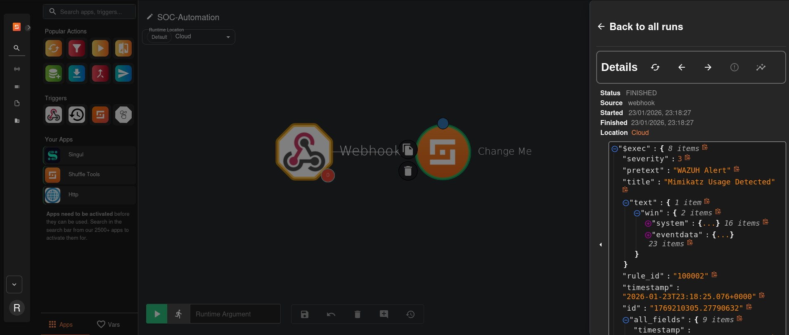
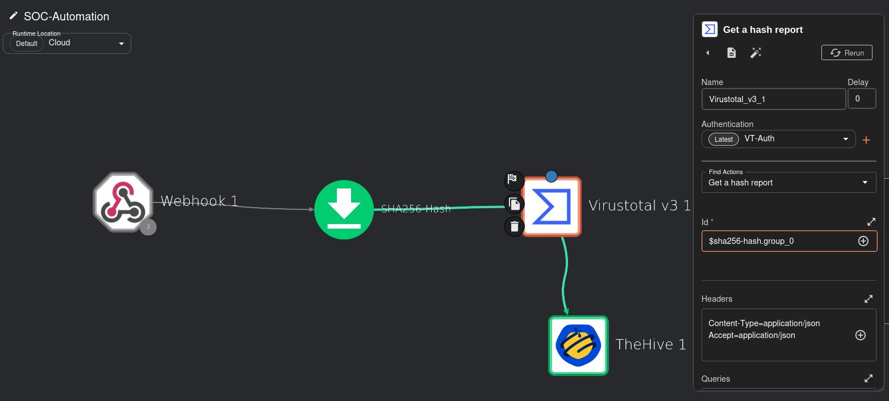
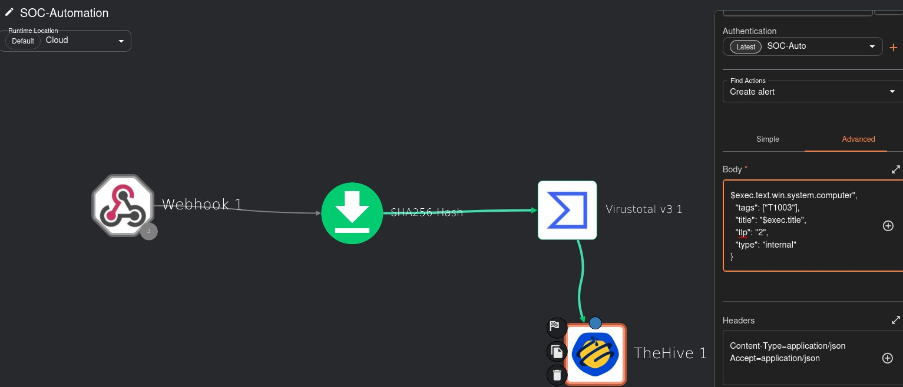
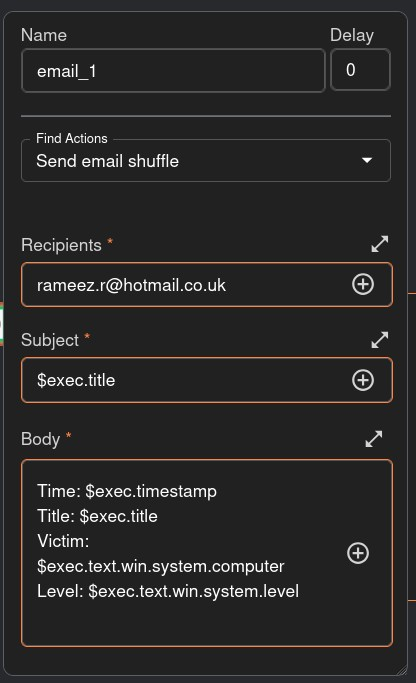

# Shuffle – SOAR Automation Configuration

## 📌 Overview

This folder contains all Shuffle-related screenshots and workflow configurations used in the SOC Automation Lab.  
Shuffle acts as the **SOAR** (Security Orchestration, Automation and Response) component, responsible for:

- Receiving alerts from Wazuh via webhook
- Extracting and enriching IOCs (SHA256 hashes) using VirusTotal
- Automatically creating cases in TheHive
- Sending email notifications to the SOC analyst

---

## 📁 Folder Contents

| File | Description |
|------|-------------|
| `Shuffler-linking.jpg` | Webhook trigger receiving the Wazuh alert payload |
| `VirusTotal-Config.jpg` | VirusTotal hash enrichment node configuration |
| `Hive-Config.jpg` | TheHive alert creation node and full workflow view |
| `Email-Response-Config.jpg` | Email notification node configuration |

---

## 🔁 Workflow – SOC-Automation

The Shuffle workflow is named **SOC-Automation** and runs in the **Cloud** runtime. It consists of four chained nodes that form a fully automated detection-to-notification pipeline.

```
Webhook 1 → SHA256 Hash Extractor → Virustotal v3 1 → TheHive 1
```

An email notification node fires in parallel to alert the SOC analyst.

---

## 1️⃣ Webhook Trigger – Receiving the Wazuh Alert



The workflow is triggered by a **Webhook** that receives the Wazuh alert in JSON format. The run details panel confirms a successful execution:

- **Status:** FINISHED
- **Source:** webhook
- **Started / Finished:** 23/01/2026, 23:18:27
- **Location:** Cloud

The incoming JSON payload contains all alert fields from Wazuh, including:

| Field | Value |
|-------|-------|
| `severity` | 3 |
| `pretext` | WAZUH Alert |
| `title` | Mimikatz Usage Detected |
| `rule_id` | 100002 |
| `timestamp` | 2026-01-23T23:18:25.076+0000 |

The `text.win.system` and `text.win.eventdata` nested objects carry the full Sysmon event data used for enrichment and case creation.

---

## 2️⃣ VirusTotal Enrichment – Hash Reputation Check



The second node passes the extracted SHA256 hash to **VirusTotal v3** for reputation analysis.

- **Action:** Get a hash report
- **Authentication:** VT-Auth (API key stored as a Shuffle credential)
- **Input ID:** `$sha256-hash.group_0` (dynamically extracted from the Wazuh alert)
- **Headers:** `Content-Type=application/json`, `Accept=application/json`

This step performs automated OSINT enrichment — checking whether the file hash associated with the Mimikatz execution is known-malicious before any analyst intervention.

---

## 3️⃣ TheHive Integration – Automated Case Creation



The third node sends the enriched alert data to **TheHive 1** to automatically create an incident case.

- **Authentication:** SOC-Auto (TheHive API key)
- **Action:** Create alert
- **Content-Type:** application/json

The alert body sent to TheHive is built dynamically from the Wazuh alert fields:

```json
{
  "$exec.text.win.system.computer",
  "tags": ["T1003"],
  "title": "$exec.title",
  "tlp": "2",
  "type": "internal"
}
```

- **Tags:** T1003 (MITRE ATT&CK – OS Credential Dumping)
- **TLP:** 2 (AMBER)
- **Type:** internal

---

## 4️⃣ Email Notification – SOC Analyst Alert



In parallel, Shuffle sends an automated email to the SOC analyst via the **Send email shuffle** action.

- **Node name:** email_1
- **Action:** Send email shuffle
- **Recipient:** rameez.r@hotmail.co.uk
- **Subject:** `$exec.title` (dynamically set to the alert title)

The email body is dynamically populated with key alert context:

```
Time:   $exec.timestamp
Title:  $exec.title
Victim: $exec.text.win.system.computer
Level:  $exec.text.win.system.level
```

This ensures the SOC analyst receives an immediate, actionable notification with the affected host, severity, and time of detection — without needing to log into any platform first.

---

## ✅ Summary

The Shuffle SOC-Automation workflow demonstrates a fully automated SOAR pipeline:

- **Trigger** – Wazuh fires an alert and sends it to Shuffle via webhook
- **Enrich** – SHA256 hash is checked against VirusTotal automatically
- **Respond** – An incident case is created in TheHive with MITRE tags and TLP classification
- **Notify** – The SOC analyst receives an email with full alert context in seconds

This eliminates manual triage steps and ensures consistent, repeatable incident handling across every detection.