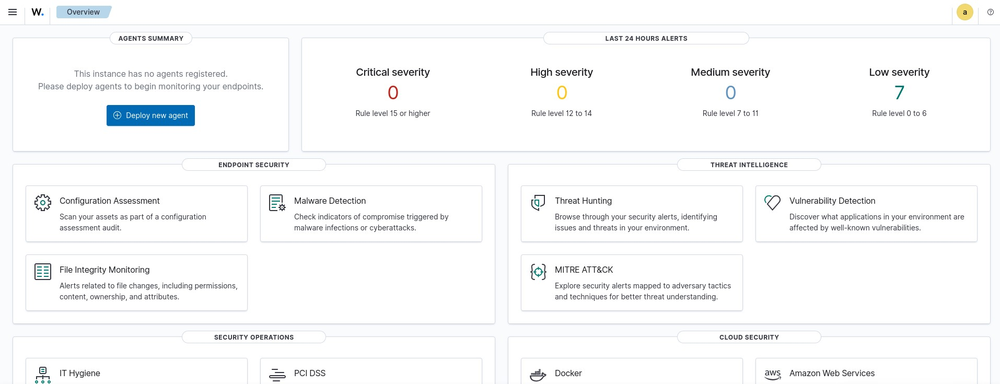
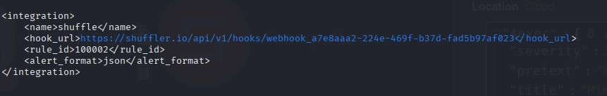
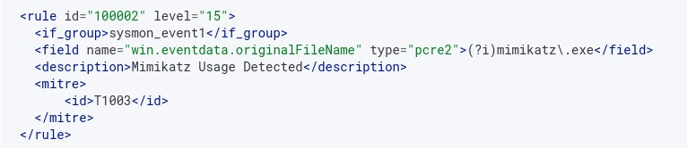
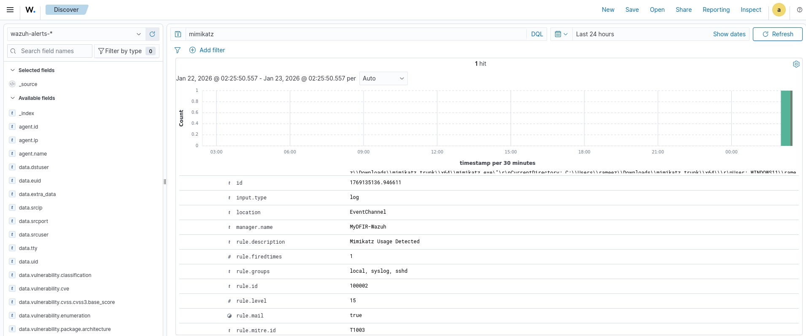
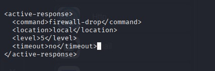

## Wazuh

# Wazuh – SIEM Configuration & Detection

## 📌 Overview

This folder contains all Wazuh-related configuration files, custom detection rules, and screenshots used in the SOC Automation Lab.  
Wazuh acts as the **SIEM** (Security Information and Event Management) component, responsible for:

- Receiving endpoint logs from the Wazuh Agent
- Applying built-in and custom detection rules
- Triggering alerts and forwarding them to Shuffle (SOAR)
- Executing active response actions on compromised endpoints

---

## 📁 Folder Contents

| File | Description |
|------|-------------|
| `wazuh.conf` | Main Wazuh Manager configuration file |
| `Mimikatz-Rule.jpg` | Custom detection rule for Mimikatz (Rule ID 100002) |
| `Mimikatz-Detection.jpg` | Alert triggered in Wazuh/OpenSearch after Mimikatz execution |
| `active-response-config.jpg` | Active response block configured in ossec.conf |
| `Shuffler-Link-ossec.jpg` | Shuffle webhook integration block in ossec.conf |
| `Wazuh-Application.jpg` | Wazuh dashboard overview |

---

## 🖥️ Wazuh Dashboard



The Wazuh dashboard provides a centralised overview of the security posture across all monitored endpoints. Key modules used in this lab include:

- **Malware Detection** – Detects indicators of compromise triggered by cyberattacks
- **Threat Hunting** – Allows analysts to browse and investigate security alerts
- **MITRE ATT&CK** – Maps alerts to adversary tactics and techniques
- **Vulnerability Detection** – Identifies known vulnerabilities across the environment

---

## 📋 Main Configuration – `wazuh.conf`

The `wazuh.conf` (ossec.conf) file is the core configuration for the Wazuh Manager. Key sections include:

### Global Settings
- JSON output and alert logging are enabled
- Alerts are logged from level 3 and above
- Email alerts trigger at level 12 and above

### Remote Agent Communication
- Agents connect securely over **TCP port 1514**
- Queue size: 131,072

### Active Modules Enabled
- **Rootcheck** – Runs every 12 hours, checks files, trojans, PIDs, ports, and interfaces
- **Syscollector** – Collects hardware, OS, network, packages, processes, users, and services every hour
- **SCA (Security Configuration Assessment)** – Runs every 12 hours
- **Vulnerability Detection** – Feed updates every 60 minutes
- **Syscheck (File Integrity Monitoring)** – Monitors `/etc`, `/bin`, `/usr/bin`, `/sbin`, and `/boot` every 12 hours

### Ruleset
Custom rules and decoders are loaded from:
- `etc/rules/` – User-defined rules (including the Mimikatz rule)
- `etc/decoders/` – User-defined decoders
- Malicious IOC lists: `malware-hashes`, `malicious-ip`, `malicious-domains`

---

## 🔗 Shuffle Integration



The Shuffle SOAR platform is integrated directly into Wazuh via a webhook. When **Rule ID 100002** fires, the alert is immediately forwarded to Shuffle in JSON format for automated enrichment and response.

```xml
<integration>
    <name>shuffle</name>
    <hook_url>https://shuffler.io/api/v1/hooks/webhook_a7e8aaa2-224e-469f-b37d-fad5b97af023</hook_url>
    <rule_id>100002</rule_id>
    <alert_format>json</alert_format>
</integration>
```

---

## 🎯 Custom Detection Rule – Mimikatz



A custom rule was written to detect the execution of **Mimikatz**, a well-known credential dumping tool. The rule uses Sysmon Event ID 1 (Process Creation) and matches against the original filename field using a case-insensitive regex.

```xml
<rule id="100002" level="15">
  <if_group>sysmon_event1</if_group>
  <field name="win.eventdata.originalFileName" type="pcre2">(?i)mimikatz\.exe</field>
  <description>Mimikatz Usage Detected</description>
  <mitre>
    <id>T1003</id>
  </mitre>
</rule>
```

- **Rule ID:** 100002  
- **Severity Level:** 15 (Critical)  
- **MITRE ATT&CK:** T1003 – OS Credential Dumping  
- **Detection Method:** Sysmon originalFileName (bypass-proof, catches renamed binaries)

---

## 🚨 Mimikatz Detection in Action



After executing Mimikatz on the Windows 10 endpoint, Wazuh successfully detected and logged the event. The alert details confirm:

- **rule.description:** Mimikatz Usage Detected  
- **rule.level:** 15  
- **rule.id:** 100002  
- **rule.mitre.id:** T1003  
- **location:** EventChannel  
- **manager.name:** MyDFIR-Wazuh  
- **rule.mail:** true (email notification triggered)

---

## 🛡️ Active Response Configuration



Wazuh is configured to automatically execute a **firewall-drop** active response when a threat is confirmed. This blocks the attacker's IP at the firewall level directly on the affected endpoint.

```xml
<active-response>
  <command>firewall-drop</command>
  <location>local</location>
  <level>5</level>
  <timeout>no</timeout>
</active-response>
```

- **Command:** `firewall-drop` – drops all traffic from the offending IP
- **Location:** `local` – response is executed on the agent where the alert fired
- **Level:** Triggers on alerts at severity level 5 and above
- **Timeout:** `no` – the block persists until manually removed

Additional active response commands configured in `wazuh.conf`:

| Command | Executable | Description |
|---------|-----------|-------------|
| `disable-account` | disable-account | Disables a user account |
| `restart-wazuh` | restart-wazuh | Restarts the Wazuh agent |
| `firewall-drop` | firewall-drop | Drops traffic from an IP |
| `host-deny` | host-deny | Adds host to deny list |
| `route-null` | route-null | Null-routes an IP |
| `win_route-null` | route-null.exe | Windows null-route |
| `netsh` | netsh.exe | Windows firewall block |

---

## ✅ Summary

The Wazuh configuration in this lab demonstrates a production-ready SIEM setup capable of:

- Detecting advanced threats like Mimikatz using custom Sysmon-based rules
- Mapping detections to the MITRE ATT&CK framework
- Automatically forwarding critical alerts to Shuffle for SOAR orchestration
- Executing real-time active response to contain compromised endpoints

This forms the detection and response backbone of the SOC Automation Lab.